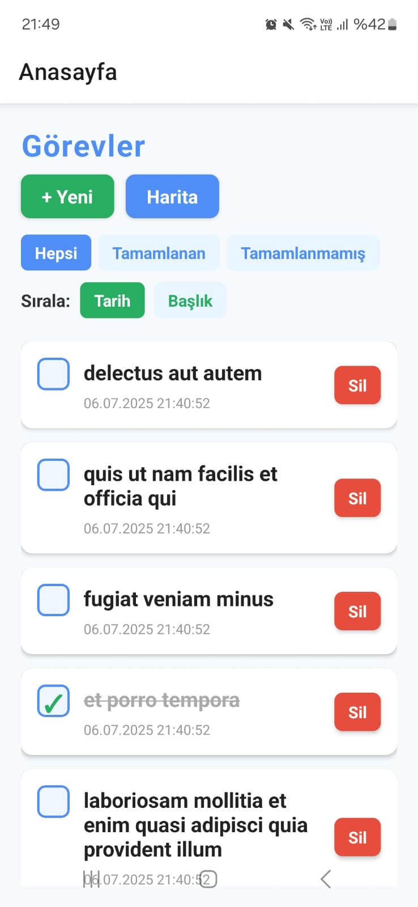
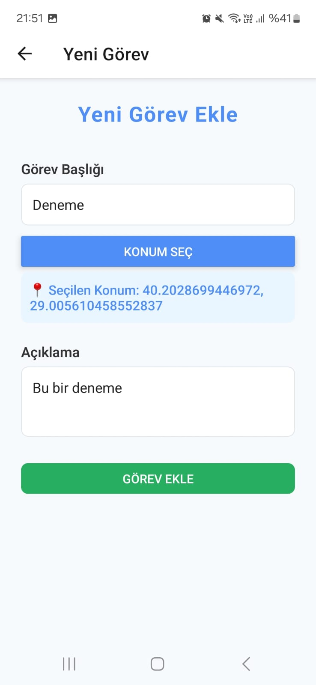
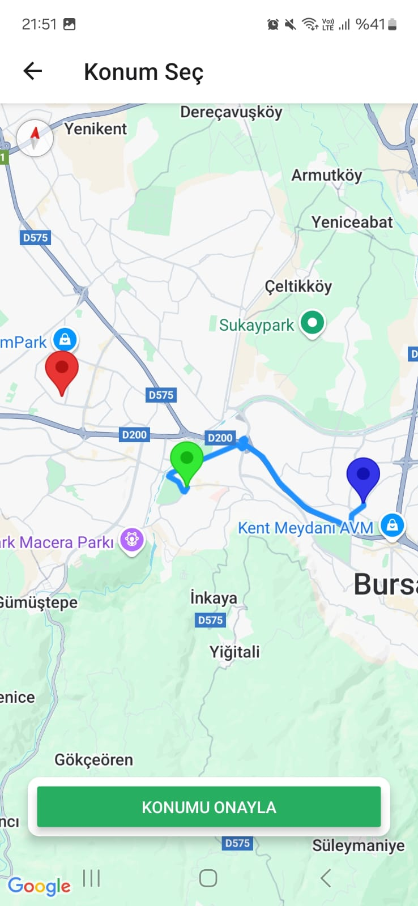
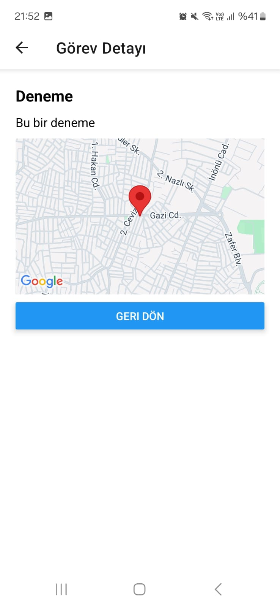
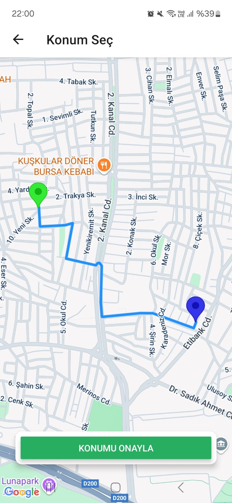

# Görev Takip ve Konum Uygulaması

## Açıklama
Bu mobil uygulama ile kullanıcılar günlük görevlerini kolayca oluşturabilir, tamamlayabilir, silebilir ve filtreleyebilir. Her görev için harita üzerinden konum seçilebilir, görev detayında konum görüntülenebilir ve kullanıcının mevcut konumundan seçilen konuma gerçek rota (polyline) çizilebilir.  
Uygulama, görev yönetimi ile harita entegrasyonunu bir araya getirerek kullanıcıya düzenli ve konum tabanlı bir görev takibi deneyimi sunar.

## Özellikler
- Görev oluşturma (başlık, açıklama, isteğe bağlı konum)
- Görevleri listeleme, silme, tamamlandı olarak işaretleme
- Görevleri filtreleme (Hepsi, Tamamlanan, Tamamlanmamış)
- Görev detay ekranı ve haritada görev konumunu gösterme
- Görevleri başlığa veya tarihe göre sıralama
- Harita üzerinden konum seçme ve marker ekleme
- Kullanıcının mevcut konumunu gösterme
- Seçilen konuma gerçek rota (Polyline) çizimi (Mapbox Directions API)
- Tüm görevlerin haritada marker olarak gösterilmesi
- Görevler ve konumlar local olarak AsyncStorage'da saklanır

## Kullanılan Teknolojiler
- React Native (Expo)
- Redux Toolkit
- React Navigation
- react-native-maps
- Mapbox Directions API
- Axios
- AsyncStorage
- Expo Location

## Kurulum
1. **Projeyi klonlayın:**
   ```sh
   git clone <repo-link>
   cd TodoApp
   ```
2. **Bağımlılıkları yükleyin:**
   ```sh
   npm install
   ```
3. **Mapbox API anahtarınızı ekleyin:**
   - Proje köküne `.env` dosyası oluşturun ve içine şunu yazın:
     ```
     MAPBOX_TOKEN=YOUR_MAPBOX_TOKEN
     ```
4. **Uygulamayı başlatın:**
   ```sh
   npx expo start
   ```

## Ekran Görüntüleri

### 1. Ana Sayfa (Görev Listesi)

- Tüm görevlerin listelendiği, filtre ve sıralama seçeneklerinin olduğu ekran.

### 2. Yeni Görev Ekleme Ekranı

- Başlık, açıklama ve konum seçme butonunun olduğu ekran.

### 3. Harita Ekranı (Konum Seçme)

- Kullanıcı konumu, görev markerları ve seçilen konumun gösterildiği ekran.
  
- Mavi= Kullanıcı konumu, Kırmızı= Önceden eklenen görevin konumu, Yeşil= Yeni seçilen konum

### 4. Görev Detay Ekranı

- Görev başlığı, açıklaması ve varsa harita üzerinde konumun gösterildiği ekran.

### 5. Rota (Polyline) Gösterimi

- Kullanıcı konumundan seçilen konuma rota çizgisinin (polyline) gösterildiği harita ekranı.


## Artı Özellikler
- Mapbox Directions API ile gerçek rota (polyline) çizimi
- Kullanıcının anlık konumu ve haritada gösterimi
- Haritada birden fazla görev marker'ı
- Local kayıt (AsyncStorage)
- Modern ve sade arayüz

## Notlar
- Mapbox Directions API ücretsiz kotası ile kullanılmaktadır.
- Kodun tamamında açıklayıcı yorumlar mevcuttur.
- Proje tamamen mobil uyumludur ve Expo ile kolayca çalışır.
